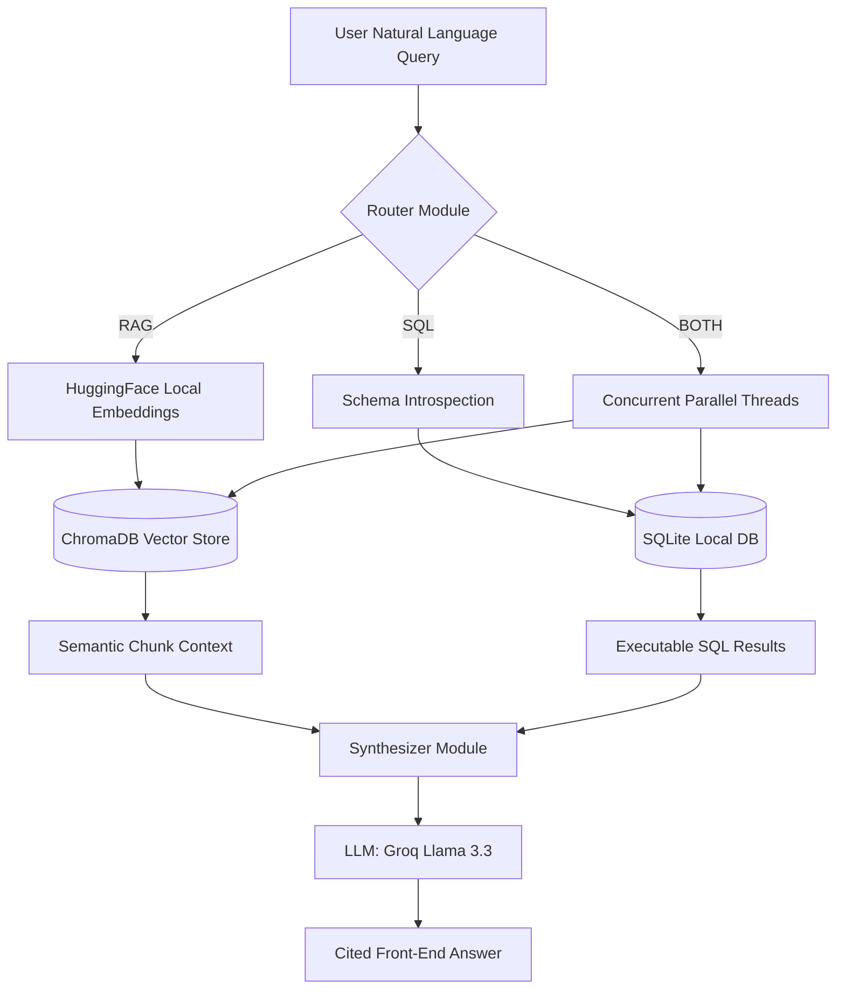

# 🧠 Hybrid RAG Pipeline

A fully-functional, freely-hosted, **Hybrid Retrieval-Augmented Generation (RAG)** pipeline that autonomously routes user queries to either a **Vector Document Knowledge Base** or a **Structured SQL Database** based on the semantic demands of the question.

---

## 🎯 Architecture & Approach

This system intelligently combines unstructured PDF documentation handling with structured live-database inspection. By executing a modular, multi-phase methodology, it removes hallucinations and answers strictly through accurately cited contexts.

### How It Works

1. **Query Router (`src/router/query_router.py`)**:
   Analyzes a natural language question. A fast, rule-based keyword mapping matches standard indicators. If ambiguous, it uses the LLM (Llama 3.3 70B via Groq) to deduce whether the query warrants Document (`RAG`), Data (`SQL`), or `BOTH` routes.
2. **Document Retrieval (RAG backend)**:
   Documents from `data/pdfs/` are chunked using `tiktoken` ensuring context token limits aren't exceeded. The embeddings are handled strictly locally using HuggingFace's `BAAI/bge-small-en-v1.5` (~90MB model), persisting efficiently into **ChromaDB**. Queries targeting semantic structures traverse this pipeline.
3. **Structured Data Retrieval (SQL backend)**:
   Queries regarding numbers, trends, or analytics jump to the SQL Text-to-SQL pipeline (`src/retrieval/sql_retriever.py`). The LLM utilizes SQLAlchemy introspection to load full schema data dynamically to author valid SQLite executions safely mapping unstructured asks into verifiable row analytics.
4. **Answer Synthesizer (`src/synthesis/synthesizer.py`)**:
   Merges vector distances and returned SQLite tabular matrices into contextual prompts. Instructs the LLM to write conversational answers and heavily enforces strict source citation (Page numbers / Data Sources) leveraging threaded concurrency to minimize bottlenecking when doing Hybrid operations.
5. **Interactive UI (`app.py`)**:
   The entire application is exposed via an internally tracked Streamlit session state offering native chat capabilities equipped with custom Expanders to visually debug intermediate SQL queries (tables) or underlying document chunk blocks fetched during search.

---

### Pipeline Flowchart



---

## 💻 Tech Stack & Dependencies

The complete stack is engineered for a **Free & Local** runtime without depending on massive credit-oriented APIs:

- **LLM Inferencing**: `Groq` API (`llama-3.3-70b-versatile`)
- **Embeddings**: Local `sentence-transformers` via HuggingFace (`BAAI/bge-small-en-v1.5`)
- **Vector DB**: Persistent `ChromaDB`
- **Application Logic**: LangChain (Core, HuggingFace, Groq interfaces)
- **Frontend**: Streamlit
- **Data Engineering**: PyPDFLoader, SQLAlchemy, SQLite, Pandas

---

## 📂 Project Structure

```text
hybrid-rag/
│
├── .env                       # API Configuration (Groq Keys)
├── requirements.txt           # Deployment Python dependencies
├── seed_database.py           # Dummy SQLite data initiator script
├── app.py                     # Streamlit frontend endpoint
│
├── data/                      # Artifact data storages
│   ├── chroma/                # Persisted vector database chunks
│   ├── db/store.db            # SQLite target structured data
│   └── pdfs/                  # Dropdown folder for document RAG
│
└── src/                       # Core Pipeline Backend
    ├── config.py              # Central module configurations
    ├── ingestion/
    │   └── pdf_ingestion.py   # Load, chunk, and embed documents script
    ├── retrieval/
    │   └── sql_retriever.py   # Secure Text-to-SQL execution module
    ├── router/
    │   └── query_router.py    # Rule + LLM-based query classifier
    └── synthesis/
        └── synthesizer.py     # Aggregation and context merging module
```

---

## 🚀 Setup & Execution

### 1. Installation Environment
Create a clean Virtual Environment and load fundamental dependencies:
```bash
python -m venv .venv
.venv\Scripts\activate
pip install -r requirements.txt
```

### 2. Configure Environment File
In the root directory, configure the minimal credentials internally:
```bash
# .env
GROQ_API_KEY=gsk_your_free_groq_api_key_here
```

### 3. Initialize & Populate Knowledge Base
Spin up both the unstructured Vector collections and the localized Structured Database matrices before running tests:
```bash
# Seed the SQL Database (creates data/db/store.db with products, orders, customers)
python seed_database.py

# Ingest, Chunk, and Model PDFs (creates data/chroma/ knowledge embeddings)
python src/ingestion/pdf_ingestion.py
```

### 4. Boot up Frontend Interface
Once models are seeded correctly, load the UI environment locally via Streamlit:
```bash
streamlit run app.py
```
> **Note:** The initial query will download the ~90MB `sentence-transformers` locally, thus the first query execution will experience minor network-download delays.
